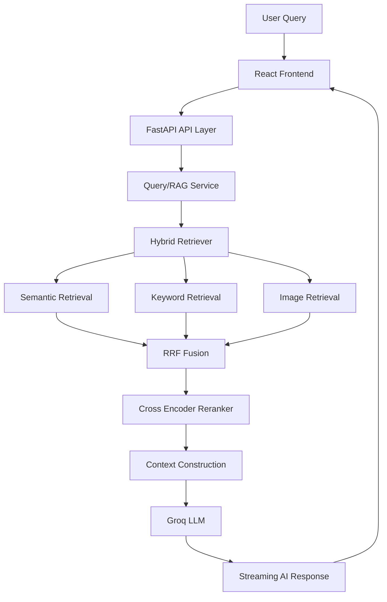
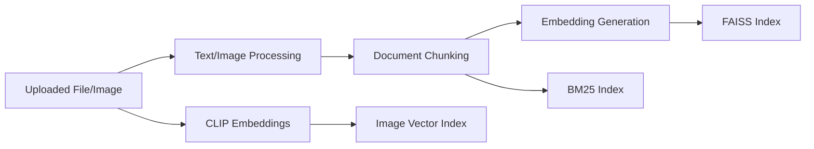
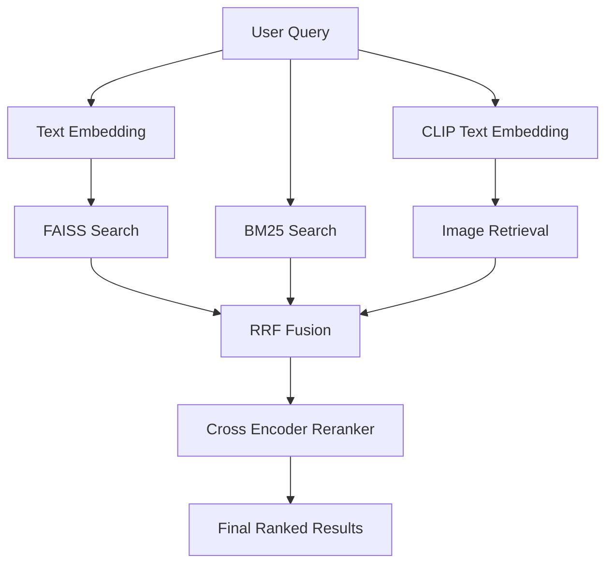
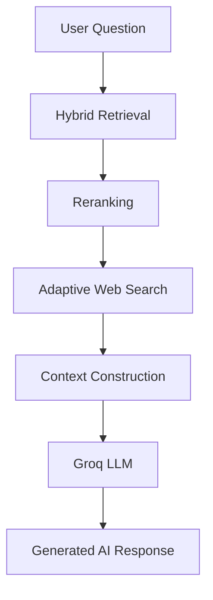

# 🚀 Multimodal Hybrid RAG System

A production-grade **Multimodal Semantic Search + Hybrid Retrieval-Augmented Generation (RAG)** platform featuring:

* 🔎 Hybrid Retrieval (FAISS + BM25 + RRF)
* 🧠 Multimodal Search (Text + Image via CLIP)
* ⚡ Real-time RAG Chat Interface
* 🌐 Adaptive Web Search Fallback
* 📊 Explainable Retrieval & Ranking
* 🎨 Modern AI-first Frontend
* 🏗️ Clean Modular Architecture

Built as a scalable AI systems project focused on:

* Retrieval engineering
* Multimodal AI
* Explainable search systems
* Production-ready RAG pipelines
* Modern frontend UX

---

# ✨ Features

## 🔎 Hybrid Retrieval Engine

Combines multiple retrieval strategies:

* Dense semantic retrieval using FAISS
* Sparse keyword retrieval using BM25
* CLIP-based multimodal image retrieval

Fusion strategies include:

* Reciprocal Rank Fusion (RRF)
* Cross-Encoder reranking

---

## 🧠 Multimodal Support

Supports:

* TXT ingestion
* PDF ingestion
* DOCX ingestion
* Image ingestion
* Text-to-image retrieval
* Cross-modal search

Powered using:

* Sentence Transformers
* OpenAI CLIP embeddings

---

## 💬 AI RAG Assistant

Modern chat-based RAG interface with:

* Streaming AI responses
* Retrieved source panels
* Confidence scoring
* Adaptive web search fallback
* Context-aware generation

LLM generation powered by:

* Groq LLM APIs

---

## 📊 Retrieval Explainability

Every retrieval result exposes:

* FAISS similarity scores
* BM25 keyword scores
* CLIP similarity scores
* RRF fusion scores
* Retriever contributions
* Rank positions
* Reranker influence

Designed to make retrieval:

* transparent
* debuggable
* explainable

---

## 🎨 Modern Frontend UX

Frontend inspired by:

* ChatGPT
* Perplexity
* Linear
* Vercel

Features:

* Responsive layout
* Dark mode
* Glassmorphism-inspired UI
* Chat-style AI interface
* Expandable source panels
* Multimodal upload flow
* Smooth animations

---

# 🧱 Tech Stack

## Backend

| Category         | Technology            |
| ---------------- | --------------------- |
| Framework        | FastAPI               |
| ORM              | SQLAlchemy 2.0 Async  |
| Database         | PostgreSQL            |
| Vector Search    | FAISS                 |
| Sparse Retrieval | BM25                  |
| Embeddings       | Sentence Transformers |
| Multimodal       | OpenAI CLIP           |
| Reranking        | Cross-Encoder         |
| LLM              | Groq                  |
| Validation       | Pydantic v2           |
| Logging          | Structlog             |

---

## Frontend

| Category         | Technology      |
| ---------------- | --------------- |
| Framework        | React           |
| Build Tool       | Vite            |
| Styling          | Tailwind CSS v3 |
| Animations       | Framer Motion   |
| Icons            | Lucide React    |
| State Management | React Hooks     |
| HTTP Client      | Axios           |
| Language         | TypeScript      |

---

# 📁 Project Structure

```plaintext
project-root/
├── backend/
│   ├── app/
│   ├── data/
│   ├── logs/
│   ├── tests/
│   └── README.md
│
├── frontend/
│   ├── src/
│   │   ├── api/
│   │   ├── components/
│   │   ├── hooks/
│   │   ├── layouts/
│   │   ├── pages/
│   │   ├── services/
│   │   ├── store/
│   │   ├── types/
│   │   └── utils/
│   │
│   ├── public/
│   └── package.json
│
└── README.md
```

---

# 🧠 System Architecture



---

# 🔄 Ingestion Pipeline



---

# 🔎 Retrieval Pipeline



---

# 💬 RAG Pipeline



---

# 📡 API Overview

| Endpoint         | Description                 |
| ---------------- | --------------------------- |
| `/upload/file`   | Upload and ingest documents |
| `/upload/image`  | Upload and ingest images    |
| `/search/search` | Hybrid semantic retrieval   |
| `/rag/rag`       | Full RAG generation         |

---

# 📂 Supported Inputs

| Type   | Supported |
| ------ | --------- |
| TXT    | ✅         |
| PDF    | ✅         |
| DOCX   | ✅         |
| Images | ✅         |

---

# 🎯 Current Capabilities

## Retrieval

* Dense semantic retrieval
* Sparse keyword retrieval
* Hybrid retrieval
* Multimodal retrieval
* RRF fusion
* Cross-encoder reranking

---

## RAG

* Context retrieval
* Adaptive web search fallback
* AI answer generation
* Confidence estimation
* Streaming-ready architecture

---

## Frontend

* AI chat interface
* Retrieval visualization
* Source panels
* Upload workflows
* Responsive UI
* Dark mode

---

# ⚡ Key Engineering Highlights

## ✅ Hybrid Retrieval Architecture

Designed to overcome limitations of:

* semantic-only retrieval
* keyword-only retrieval

using:

* dense + sparse fusion
* reranking
* adaptive retrieval strategies

---

## ✅ Explainable AI Retrieval

Provides transparent ranking information for:

* debugging
* evaluation
* retrieval inspection
* ranking analysis

---

## ✅ Modular Clean Architecture

Strict separation between:

* APIs
* services
* retrieval systems
* ML modules
* frontend UI
* business logic

---

## ✅ Async-First Backend

Features:

* Async SQLAlchemy
* Async ingestion
* Async retrieval
* Async RAG generation
* Streaming-ready responses

---

## ✅ Modern AI UX

Frontend focuses heavily on:

* usability
* interaction quality
* minimal clutter
* AI-native experience

---

---

# 🛠️ Reproducible Setup & Quickstart

### 1️⃣ One-Step Automated Environment Setup

```bash
python scripts/setup_env.py
```
This script checks Python dependencies, initializes `.env` configurations from `.env.example`, and creates required data directories (`data/indexes`, `models`).

---

### 2️⃣ Pytest Modular Unit & Integration Test Suite

Run the full unit test suite covering chunking, embeddings, FAISS, BM25, RRF fusion, Cross-Encoder reranking, and REST API endpoints:

```bash
python scripts/run_all_tests.py
```
Or directly with pytest:
```bash
pytest backend/tests
```

---

### 3️⃣ Containerized Deployment (Docker Compose)

Launch PostgreSQL database, FastAPI backend, and React frontend in multi-container isolation:

```bash
docker-compose up --build
```

---

### 4️⃣ CPU-Friendly Fine-Tuning & Evaluation Pipeline

```bash
# 1. Generate synthetic contrastive fine-tuning samples
python -m backend.scripts.generate_synthetic_dataset

# 2. Run lightweight CPU fine-tuning (~5 min)
python -m backend.scripts.fine_tune_embedder

# 3. Calculate MRR@10, NDCG@10, Recall@5 metrics
python -m backend.scripts.evaluate_retrieval
```

---

# 📚 System Documentation (`docs/`)

* 🏗️ [Architecture Specifications](docs/ARCHITECTURE.md)
* 🧠 [Fine-Tuning & Evaluation Guide](docs/FINE_TUNING_GUIDE.md)
* 📡 [REST API Documentation](docs/API_DOCUMENTATION.md)
* 📊 [Retrieval Evaluation Benchmarks](docs/EVALUATION_BENCHMARKS.md)

---

# 📦 Manual Installation

---

# 🌟 Why This Project Matters

Traditional RAG systems often struggle because:

* semantic retrieval misses exact keyword matches
* keyword retrieval misses contextual meaning
* rankings are opaque
* multimodal retrieval is unsupported
* retrieval quality is difficult to debug

This project addresses those challenges through:

* hybrid retrieval
* explainable ranking
* multimodal embeddings
* adaptive retrieval strategies
* reranking pipelines
* modern AI-first UX

---

# 🚧 Future Improvements

Planned enhancements:

* Query expansion
* MMR retrieval diversification
* Context compression
* Metadata filtering
* GPU FAISS acceleration
* Advanced reranking
* Retrieval evaluation suite
* Agentic workflows
* Real-time streaming tokens
* Vector database integration

---

# 🛠️ Engineering Goals

This system was built with emphasis on:

* Scalability
* Explainability
* Retrieval quality
* Production readiness
* Modularity
* Clean architecture
* AI system transparency

---

# 👨‍💻 Author Notes

This project was built as:

* a production-style AI systems project
* a retrieval engineering exploration
* a multimodal search system
* a scalable RAG platform
* a modern AI product prototype

The focus was not only on “making RAG work”, but on understanding:

* retrieval failures
* ranking behavior
* reranking quality
* retrieval fusion
* context engineering
* explainability
* AI UX design
* production engineering tradeoffs

---
