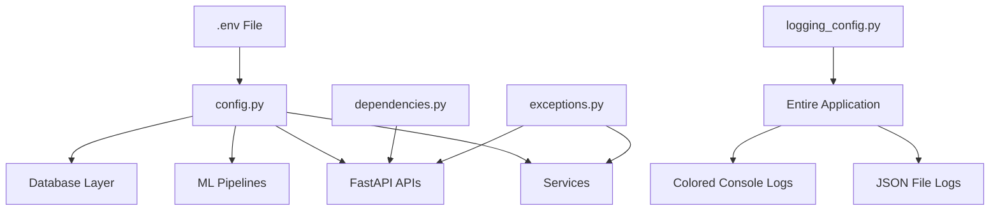
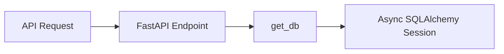
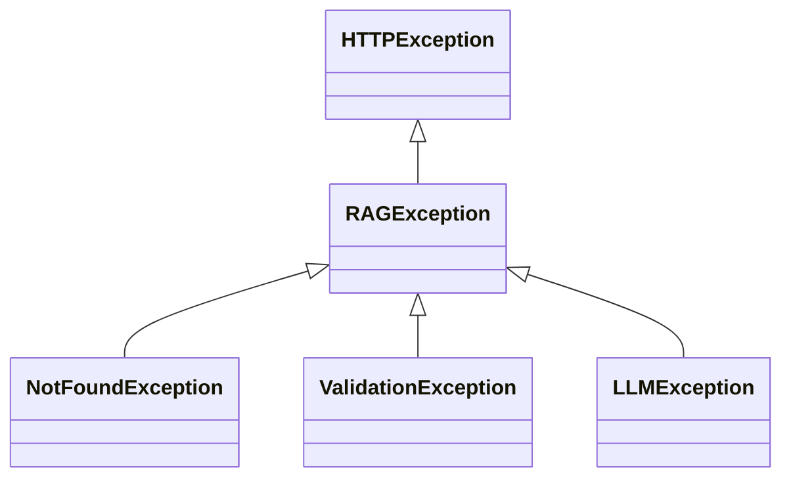
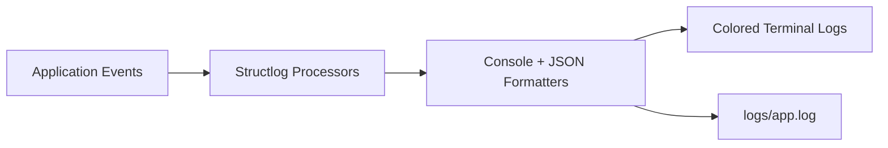

# Core Module (`app/core`)

The `core/` module contains the foundational infrastructure and global configuration layer of the Multimodal Hybrid RAG System.

It centralizes:

- Environment & application settings
- Dependency injection
- Exception handling
- Structured logging
- Shared application-wide utilities

This module acts as the backbone of the backend system and ensures consistency across APIs, services, retrieval pipelines, and ML components.

---

# 📁 Folder Structure

```plaintext
core/
├── config.py
├── dependencies.py
├── exceptions.py
└── logging_config.py
```

---

# 🧠 Purpose of the Core Module

The `core` layer exists to:

- Keep infrastructure concerns separated from business logic
- Provide centralized configuration management
- Ensure production-grade logging and observability
- Standardize application errors
- Simplify dependency injection across FastAPI routes/services

---

# 🔄 Core Architecture Flow



---

# 📄 File Breakdown

---

# `config.py`

Centralized application configuration using:

- `Pydantic Settings`
- `.env` environment variables
- Type-safe settings validation

---

## ✅ Responsibilities

- Load environment variables
- Store ML model configuration
- Store database configuration
- Configure API versioning
- Store vector index paths
- Store external API credentials

---

## 🔑 Key Configurations

### General App Settings

```python
PROJECT_NAME
ENVIRONMENT
DEBUG
API_V1_STR
API_V2_STR
```

### Database

```python
DATABASE_URL
```

### Logging

```python
LOG_LEVEL
```

### Embedding & Retrieval

```python
EMBEDDING_MODEL
CLIP_MODEL
FAISS_INDEX_PATH
FAISS_IMAGE_INDEX_PATH
BM25_INDEX_PATH
```

### LLM & Web Search

```python
GROQ_API_KEY
GROQ_MODEL
TAVILY_API_KEY
WEB_SEARCH_THRESHOLD
TAVILY_MAX_RESULTS
```

---

## ⚡ Advantages

- Type-safe configuration
- Clean `.env` integration
- Easy deployment portability
- Centralized settings access

---

# `dependencies.py`

Provides reusable FastAPI dependencies.

---

## ✅ Responsibilities

- Database session injection
- Shared dependency management

---

## 🔄 Flow



---

## Example

```python
async def get_db():
    async for session in get_async_session():
        yield session
```

---

## Why This Matters

This enables:

- Automatic session lifecycle management
- Clean route handlers
- Proper async DB handling
- Separation of concerns

---

# `exceptions.py`

Defines custom application-level exceptions.

Instead of raising generic HTTP errors everywhere, the system uses domain-specific exception classes.

---

# 📚 Exception Hierarchy



---

# Available Exceptions

| Exception | Purpose |
|---|---|
| `RAGException` | Base system exception |
| `NotFoundException` | Missing resource |
| `ValidationException` | Invalid request/input |
| `LLMException` | LLM/Groq-related failure |

---

## ✅ Advantages

- Cleaner error handling
- Consistent API responses
- Easier debugging
- Better frontend integration

---

# `logging_config.py`

Implements production-grade structured logging using:

- `structlog`
- JSON log formatting
- Colored console output
- File-based persistent logging

---

# 🧠 Logging Features

---

## 🎨 Colored Console Logs

Example:

```plaintext
✨ INFO | 12:31:20 | app.services.query | Query completed
⚠️ WARNING | 12:31:25 | app.ml.retrieval | Low confidence retrieval
❌ ERROR | 12:31:27 | uvicorn.error | Exception in ASGI application
```

---

## 📦 JSON File Logging

Logs are also stored in:

```plaintext
logs/app.log
```

Example JSON log:

```json
{
  "event": "Hybrid retrieval completed",
  "logger": "app.ml.retrieval",
  "level_display": "✨ INFO",
  "timestamp": "12:40:20"
}
```

---

# 🔄 Logging Pipeline



---

# ✅ Logging Capabilities

| Feature | Supported |
|---|---|
| Colored console logs | ✅ |
| JSON file logging | ✅ |
| Timestamped logs | ✅ |
| Emoji log levels | ✅ |
| Structured metadata | ✅ |
| Library noise reduction | ✅ |
| Async-safe logging | ✅ |

---

# 🔕 Noise Reduction

The logging layer suppresses excessive logs from:

- SQLAlchemy
- Transformers
- Sentence Transformers
- HuggingFace Hub
- HTTPX
- Uvicorn Access Logs

This keeps debugging output clean and developer-friendly.

---

# 🚀 Why the Core Module Matters

Without the `core/` layer:

- Configuration becomes scattered
- Logging becomes inconsistent
- Error handling becomes chaotic
- Dependency injection becomes repetitive
- Debugging production issues becomes difficult

This module ensures the system remains:

- Maintainable
- Scalable
- Observable
- Production-ready

---

# ✅ Summary

The `core/` module provides the shared infrastructure powering the entire Multimodal Hybrid RAG backend.

It handles:

- Global configuration
- Dependency management
- Structured logging
- Centralized exceptions
- Application-wide consistency

This creates a clean and scalable foundation for:

- APIs
- ML pipelines
- Retrieval systems
- RAG orchestration
- External integrations