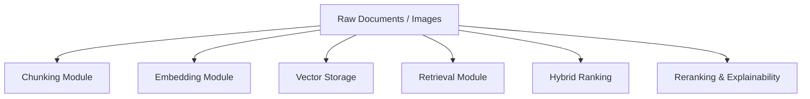
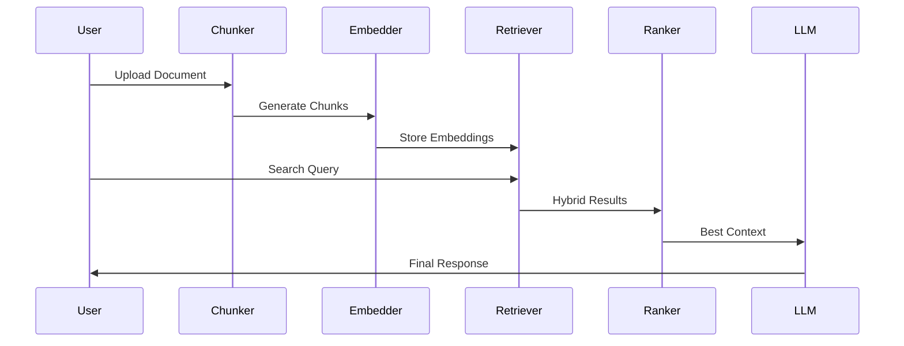

# ML Module

The `ml/` module is the core intelligence layer of the Hybrid RAG system.

It contains all machine learning and retrieval components responsible for:

- Document chunking
- Embedding generation
- Semantic retrieval
- Keyword retrieval
- Multimodal search
- Hybrid ranking
- Retrieval pipelines
- Explainability

This module powers the complete Retrieval-Augmented Generation (RAG) workflow.

---

# Folder Structure

```plaintext
ml/
│
├── chunking/
├── embeddings/
├── retrieval/
├── ranking/
├── pipelines/
└── utils/
```

---

# ML System Overview



---

# Module Responsibilities

| Module | Purpose |
|---|---|
| `chunking/` | Splits documents into retrieval-friendly chunks |
| `embeddings/` | Generates dense vector embeddings |
| `retrieval/` | Performs semantic + keyword + multimodal retrieval |
| `ranking/` | Handles ranking, reranking, and explainability |
| `pipelines/` | Orchestrates ingestion and retrieval workflows |


---

# 1. chunking/

## Purpose

Transforms large documents into smaller semantic units called chunks.

Why chunking matters:
- LLM context limits
- Better retrieval precision
- Improved semantic matching
- Efficient indexing

Supports:
- Text chunking
- Image description chunking

---

# 2. embeddings/

## Purpose

Converts text and images into dense vector representations.

Supports:
- Semantic embeddings
- CLIP multimodal embeddings
- Text-to-image retrieval

Key technologies:
- Sentence Transformers
- CLIP

---

# 3. retrieval/

## Purpose

Responsible for retrieving relevant information from vector and keyword indexes.

Implements:
- FAISS semantic retrieval
- BM25 keyword retrieval
- CLIP image retrieval
- Hybrid retrieval orchestration
- Reciprocal Rank Fusion (RRF)

---

# 4. ranking/

## Purpose

Improves retrieval quality using advanced ranking techniques.

Handles:
- RRF ranking
- Cross-encoder reranking
- Explainability
- Score analysis
- Confidence estimation

---

# 5. pipelines/

## Purpose

Coordinates end-to-end ML workflows.

Examples:
- Document ingestion pipeline
- Embedding generation pipeline
- Retrieval pipeline
- Indexing orchestration

Acts as the execution layer connecting all ML components.

---

# ML Processing Pipeline



---

# Key Design Principles

## Modular Architecture

Every component is isolated and independently replaceable.

Example:
- Replace FAISS with Qdrant
- Replace BM25 with Elasticsearch
- Replace CLIP with SigLIP

Without changing the entire system.

---

# Async-First Design

The ML module heavily uses:
- Async processing
- Batched operations
- Concurrent retrieval

Benefits:
- Better FastAPI scalability
- Higher throughput
- Reduced latency

---

# Explainable Retrieval

The system stores:
- Raw retrieval scores
- Retriever origins
- Rank positions
- Fusion scores

Enabling:
- Transparent ranking
- Retrieval debugging
- Explainability APIs

---

# Multimodal Support

The architecture supports:
- Text retrieval
- Image retrieval
- Cross-modal retrieval

This allows:
- Text → Image search
- Image → Image search
- Multimodal RAG workflows

---

# Production-Oriented Features

The ML module includes:

✅ Lazy model loading  
✅ GPU acceleration  
✅ Batch processing  
✅ Async pipelines  
✅ Hybrid retrieval  
✅ Multimodal indexing  
✅ Explainable ranking  
✅ Threshold filtering  
✅ Structured retrieval metadata  

---

# Technologies Used

| Technology | Purpose |
|---|---|
| Sentence Transformers | Semantic embeddings |
| CLIP | Multimodal embeddings |
| FAISS | Vector similarity search |
| BM25 | Sparse keyword retrieval |
| PyTorch | Deep learning inference |
| Transformers | CLIP model support |

---

# Current Capabilities

✅ Semantic Search  
✅ Hybrid Retrieval  
✅ Multimodal Retrieval  
✅ Cross-Encoder Reranking  
✅ Explainable Search  
✅ Async ML Pipelines  
✅ Production-Grade Retrieval  

---

# Future Improvements

Planned enhancements:

- Distributed vector search
- ANN optimization
- Multi-GPU inference
- Adaptive retrieval routing
- Query intent classification
- Audio embeddings
- Video embeddings
- Online learning rerankers
- Dynamic retrieval weighting

---

# Summary

The `ml/` module is the intelligence backbone of the Hybrid RAG system.

It combines:
- Semantic understanding
- Hybrid retrieval
- Multimodal search
- Explainable ranking
- Scalable ML pipelines

to deliver production-grade Retrieval-Augmented Generation capabilities.