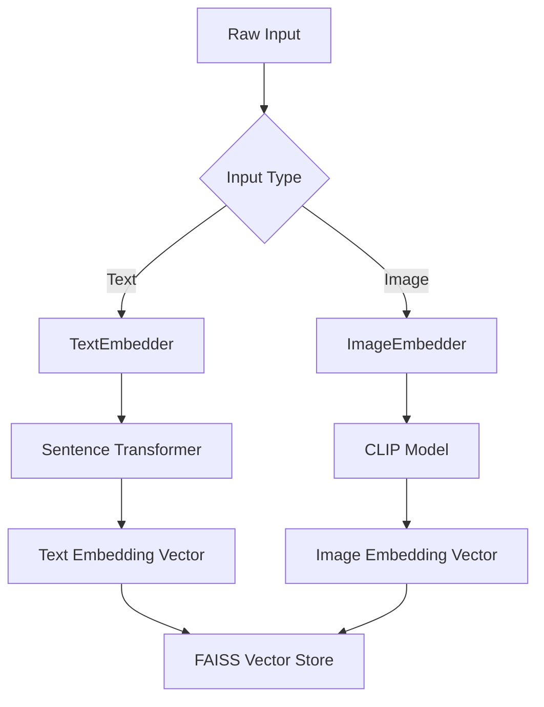
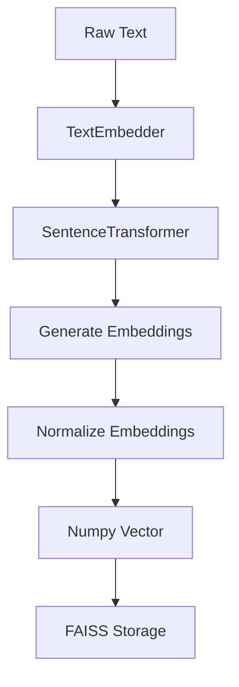
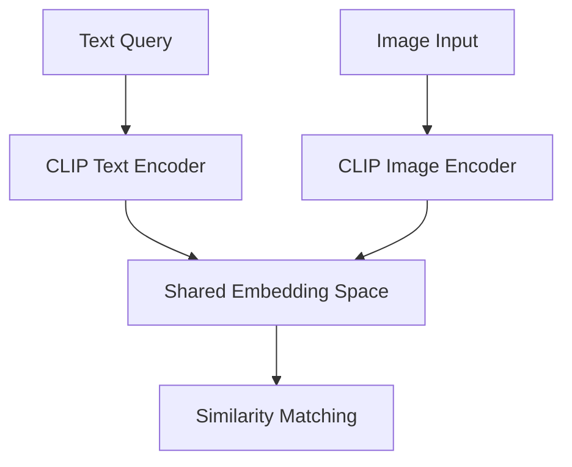
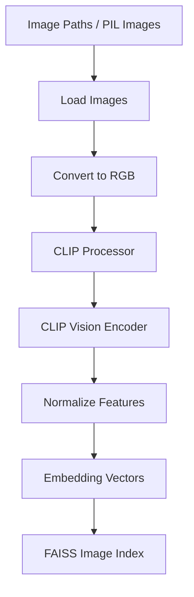

# Embeddings Module

The `embeddings/` module is responsible for converting raw data into dense vector representations that can be used for:

- Semantic Search
- Similarity Matching
- Hybrid Retrieval
- Multimodal Retrieval
- Retrieval-Augmented Generation (RAG)

This module provides a unified abstraction layer for:
- Text Embeddings
- Image Embeddings
- Cross-modal embeddings

---

# Folder Structure

```plaintext
embeddings/
│
├── base_embedder.py
├── text_embedder.py
└── image_embedder.py
```

---

# Why Embeddings Matter

Traditional keyword search only matches exact words.

Embeddings allow the system to:
- Understand semantic meaning
- Capture context
- Retrieve related concepts
- Enable multimodal search

Example:

| Query | Retrieved Concept |
|---|---|
| "car accident" | "vehicle collision" |
| "AI model" | "neural network" |
| "snow continent" | "Antarctica" |

This is the foundation of modern semantic retrieval systems.

---

# Embedding Architecture



---

# 1. base_embedder.py

## Purpose

Defines the abstract interface for all embedding models.

This ensures:
- Standardized embedding APIs
- Easy model replacement
- Modular architecture
- Clean dependency injection

---

# Why Use an Abstract Base Class?

Without abstraction:
- Every embedder behaves differently
- Retrieval code becomes tightly coupled
- Replacing models becomes difficult

With abstraction:
- All embedders expose the same interface
- Components remain interchangeable

---

# Core Interface

```python
class BaseEmbedder(ABC)
```

Defines:

## Text Embedding

```python
async def embed_text(text: List[str]) -> np.ndarray
```

Converts text into vector embeddings.

---

## Image Embedding

```python
async def embed_image(images) -> np.ndarray
```

Converts images into vector embeddings.

---

## Embedding Dimension

```python
@property
def dimension(self) -> int
```

Returns:
- Embedding vector size
- Required for FAISS index creation

---

# Design Benefits

✅ Standardized APIs  
✅ Plug-and-play embedders  
✅ Clean architecture  
✅ Future model flexibility  
✅ Easier testing and scaling  

---

# 2. text_embedder.py

## Purpose

Handles semantic text embeddings using Sentence Transformers.

This is the primary embedding engine for:
- Semantic Search
- Dense Retrieval
- Text Similarity
- RAG Pipelines

---

# Model Used

```python
sentence-transformers
```

Configured through:

```python
settings.EMBEDDING_MODEL
```

Example models:

- `all-MiniLM-L6-v2`
- `bge-base-en`
- `e5-large`
- `gte-large`

---

# Text Embedding Flow



---

# Key Features

## Lazy Loading

The model loads only when first used.

```python
if self._model is None:
```

Advantages:
- Faster application startup
- Lower initial memory usage
- Better production scalability

---

## Async Architecture

Uses:

```python
asyncio.run_in_executor()
```

Benefits:
- Non-blocking embedding generation
- Better FastAPI performance
- Concurrent processing support

---

## Embedding Normalization

```python
normalize_embeddings=True
```

Why normalization matters:

- Stable cosine similarity
- Better semantic comparison
- Improved FAISS retrieval accuracy

---

# GPU Support

Automatically detects CUDA:

```python
self.device = "cuda" if torch.cuda.is_available() else "cpu"
```

Supports:
- GPU acceleration
- CPU fallback

---

# Main Method

```python
embed_text(texts: List[str])
```

Returns:

```python
np.ndarray
```

Example:

```python
[
    [0.124, -0.552, ...],
    [0.991,  0.120, ...]
]
```

Shape:

```python
(batch_size, embedding_dimension)
```

---

# Why Sentence Transformers?

Sentence Transformers provide:
- High semantic quality
- Efficient inference
- Production-ready embeddings
- Strong retrieval performance

They are widely used in:
- RAG systems
- Search engines
- Semantic matching
- Enterprise AI pipelines

---

# 3. image_embedder.py

## Purpose

Handles multimodal image embeddings using CLIP.

This enables:
- Image similarity search
- Text-to-image retrieval
- Multimodal RAG
- Cross-modal understanding

---

# Model Used

```python
transformers.CLIPModel
```

Configured through:

```python
settings.CLIP_MODEL
```

Example:

```python
openai/clip-vit-base-patch32
```

---

# CLIP Architecture

CLIP learns a shared embedding space for:
- Text
- Images

Meaning:
- Related text and images produce nearby vectors

---

# CLIP Workflow



---

# Image Embedding Flow



---

# Key Features

## Lazy Loading

CLIP model loads only when needed.

Improves:
- Startup performance
- Memory efficiency

---

## Parallel Image Loading

Images are loaded in parallel using:

```python
run_in_executor()
```

Benefits:
- Faster ingestion
- Better scalability
- Reduced blocking I/O

---

## Batch Embedding

Images are processed in batches:

```python
inputs = self._processor(images=pil_images)
```

Advantages:
- GPU utilization
- Faster throughput
- Production efficiency

---

# Feature Normalization

```python
features = features / features.norm(dim=1, keepdim=True)
```

Ensures:
- Stable cosine similarity
- Better vector retrieval
- Consistent embedding magnitude

---

# Text Embeddings via CLIP

The module also supports:

```python
embed_text()
```

This is critical for:
- Text → Image retrieval
- Multimodal search

Example:

```plaintext
Query:
"red sports car"

Retrieved:
Relevant car images
```

---

# Image Retrieval Capabilities

| Capability | Supported |
|---|---|
| Image → Image Search | ✅ |
| Text → Image Search | ✅ |
| Multimodal Retrieval | ✅ |
| Cross-modal Similarity | ✅ |

---

# Error Handling

The embedder safely handles:
- Corrupted images
- Invalid paths
- Failed image loading

Invalid images are skipped automatically.

---

# Device Handling

Supports:
- CUDA GPUs
- CPU fallback

Automatically selected at runtime.

---

# Embedding Dimensions

The dimension is dynamically extracted:

```python
self._model.config.projection_dim
```

This ensures:
- Correct FAISS index configuration
- Model flexibility
- Dynamic embedding support

---

# Production-Oriented Design

The embeddings module is designed for:

## Scalability

- Async inference
- Batch processing
- Lazy loading

---

## Flexibility

Easy to swap models:

```python
settings.EMBEDDING_MODEL
settings.CLIP_MODEL
```

---

## Modularity

Each embedder is isolated and reusable.

---

## Multimodal Support

Supports:
- Text
- Images
- Cross-modal retrieval

---

# Current Capabilities

✅ Semantic Text Embeddings  
✅ CLIP Image Embeddings  
✅ Text-to-Image Retrieval  
✅ Async Embedding Generation  
✅ GPU Acceleration  
✅ Batch Processing  
✅ Embedding Normalization  
✅ Lazy Model Loading  
✅ Production-Ready Architecture  

---

# Future Improvements

Planned enhancements:

- Quantized embedding models
- ONNX acceleration
- Distributed inference
- Multi-GPU embedding
- Embedding caching
- Hybrid sparse+dense embeddings
- Audio embeddings
- Video embeddings

---

# Summary

The embeddings module forms the semantic intelligence layer of the system.

It enables:
- Semantic understanding
- Multimodal retrieval
- Vector search
- RAG grounding

By combining:
- Sentence Transformers
- CLIP
- Async processing
- GPU acceleration

the system achieves scalable, production-grade embedding generation for modern AI retrieval systems.