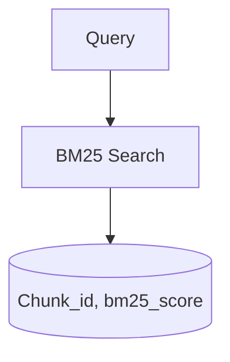
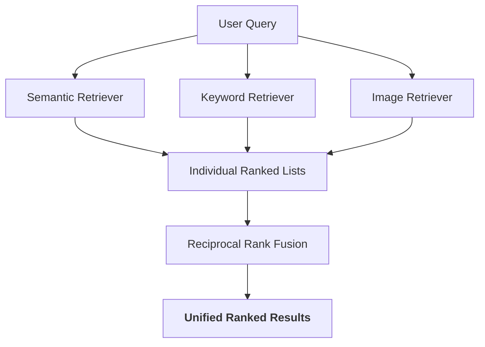

# Retrieval Module

The `retrieval/` module is responsible for the **core search logic** of the Hybrid RAG system.  
It combines multiple retrieval strategies:

- Dense Semantic Search (FAISS)
- Sparse Keyword Search (BM25)
- Multimodal Image Retrieval (CLIP)
- Reciprocal Rank Fusion (RRF)

This module acts as the **retrieval orchestration layer** before reranking and answer generation.

---

# Folder Structure

```plaintext
retrieval/
│
├── faiss_manager.py
├── bm25_manager.py
├── semantic_retriever.py
├── keyword_retriever.py
├── hybrid_retriever.py
└── retrieval_result.py
```

---

# Retrieval Pipeline Overview

```plaintext
                    User Query
                         │
         ┌───────────────┼────────────────┐
         │               │                │
         ▼               ▼                ▼
 Semantic Search    Keyword Search    Image Search
   (FAISS)             (BM25)            (CLIP)
         │               │                │
         └───────────────┼────────────────┘
                         ▼
              Reciprocal Rank Fusion
                         ▼
                Hybrid Ranked Results
                         ▼
                  Reranker Layer
                         ▼
                     Final Results
```

---

# 1. semantic_retriever.py

## Purpose

Handles **dense vector semantic retrieval** using FAISS.

This retriever:
- Converts user queries into embeddings
- Searches the FAISS vector index
- Returns semantic similarity matches

---

## Workflow

```plaintext
Query
  │
  ▼
TextEmbedder
  │
  ▼
Query Embedding
  │
  ▼
FAISS Search
  │
  ▼
(chunk_id, similarity_score)
```

---

## Core Responsibilities

- Generate query embeddings
- Perform vector similarity search
- Return top-k semantic matches

---

## Main Method

```python
retrieve(query: str, k: int)
```

Returns:

```python
List[Tuple[int, float]]
```

Example:

```python
[
    (12, 0.84),
    (31, 0.79),
]
```

Where:
- `12` = chunk ID
- `0.84` = semantic similarity score

---

# 2. keyword_retriever.py

## Purpose

Handles traditional **keyword-based retrieval** using BM25.

BM25 excels at:
- Exact term matching
- Technical keywords
- Acronyms
- Precise document retrieval

---

## Workflow



---

## Core Responsibilities

- Perform sparse retrieval
- Match lexical relevance
- Return BM25 scores

---

## Main Method

```python
retrieve(query: str, k: int)
```

Returns:

```python
List[Tuple[int, float]]
```

Example:

```python
[
    (7, 12.5),
    (21, 10.8),
]
```

---

# 3. hybrid_retriever.py

## Purpose

This is the **central orchestration engine** of the retrieval layer.

It combines:
- Semantic retrieval
- Keyword retrieval
- CLIP image retrieval

Then merges them using:
- Reciprocal Rank Fusion (RRF)

---

# Why Hybrid Retrieval?

Single retrieval systems are weak alone.

| Retrieval Type | Strength | Weakness |
|---|---|---|
| Semantic | Understands meaning | Misses exact terms |
| BM25 | Exact keyword matching | Misses semantic intent |
| CLIP | Cross-modal retrieval | Specialized use case |

Hybrid retrieval combines all strengths.

---

# Retrieval Flow



---

# Retrieval Components

## Semantic Retrieval

```python
sem_results = await self.semantic.retrieve(query, k * 2)
```

Uses:
- Sentence Transformers
- FAISS vector similarity

---

## Keyword Retrieval

```python
kw_results = await self.keyword.retrieve(query, k)
```

Uses:
- BM25 sparse retrieval

---

## Image Retrieval

```python
image_query_emb = await self.image_embedder.embed_text([query])
```

Uses:
- CLIP text encoder
- FAISS image vector index

Enables:
- Text → Image retrieval

---

# Score Filtering

Each retriever applies thresholds:

```python
sem_results = [(cid, s) for cid, s in sem_results if s > 0.3]
kw_results = [(cid, s) for cid, s in kw_results if s > 1.0]
image_results = [(cid, s) for cid, s in image_results if s > 0.25]
```

Purpose:
- Remove weak/noisy results
- Improve retrieval precision

---

# Reciprocal Rank Fusion (RRF)

Instead of merging raw scores directly,
the system merges based on ranking positions.

Formula:

```plaintext
RRF Score = Σ (1 / (k + rank))
```

Advantages:
- Score-agnostic
- Stable
- Robust across retrievers
- Production-grade retrieval fusion

---

# Weighted Fusion

Each retriever contributes differently:

```python
update(sem_results, "faiss", weight=1.0)
update(kw_results, "bm25", weight=0.5)
update(image_results, "clip", weight=0.3)
```

Meaning:
- Semantic retrieval has highest importance
- BM25 adds lexical precision
- CLIP contributes multimodal signals

---

# Final Output

Returns:

```python
List[HybridResult]
```

Sorted by:

```python
rrf_score
```

---

# 4. retrieval_result.py

## Purpose

Defines the structured data model for retrieval results.

Implemented using:

```python
@dataclass
```

---

# HybridResult Structure

```python
HybridResult(
    chunk_id=12,
    faiss_score=0.82,
    bm25_score=12.4,
    clip_score=None,
    ranks={"faiss": 1, "bm25": 4},
    rrf_score=0.032,
)
```

---

# Stored Information

| Field | Purpose |
|---|---|
| chunk_id | Retrieved chunk identifier |
| faiss_score | Semantic similarity score |
| bm25_score | BM25 lexical score |
| clip_score | CLIP similarity score |
| ranks | Rank position from each retriever |
| rrf_score | Reciprocal Rank Fusion score |
| fusion_score | Optional future fusion score |
| final_score | Final reranked score |

---

# Why This Structure Matters

This object enables:
- Explainable retrieval
- Score tracing
- Debugging
- Reranking
- Future analytics
- Observability

It is critical for:
- Explainability APIs
- Ranking diagnostics
- Hybrid optimization

---

# Design Philosophy

The retrieval layer follows:

## Modular Architecture

Each retriever is isolated and replaceable.

Example:
- Replace FAISS with Qdrant
- Replace BM25 with Elasticsearch
- Replace CLIP with SigLIP

Without changing orchestration logic.

---

## Explainable Retrieval

The system stores:
- Raw scores
- Rank positions
- Retriever origin

This enables:
- Transparent ranking explanations
- Retrieval debugging
- Confidence analysis

---

## Production-Oriented Design

Features include:
- Threshold filtering
- Weighted fusion
- Async retrieval
- Multimodal support
- Structured ranking

---

# Example Hybrid Retrieval Result

```python
[
    HybridResult(
        chunk_id=15,
        faiss_score=0.84,
        bm25_score=11.3,
        ranks={
            "faiss": 1,
            "bm25": 3
        },
        rrf_score=0.0317
    )
]
```

---

# Current Capabilities

✅ Semantic Retrieval  
✅ BM25 Retrieval  
✅ Image Retrieval  
✅ Reciprocal Rank Fusion  
✅ Weighted Hybrid Search  
✅ Explainable Ranking Metadata  
✅ Async Retrieval Pipeline  
✅ Multimodal Support  

---

# Future Improvements

Planned enhancements:

- Cross-Encoder reranking
- Dynamic retriever weighting
- Query intent detection
- Adaptive retrieval routing
- Metadata-aware retrieval
- Hybrid confidence calibration
- ANN optimization
- Distributed vector search

---

# Summary

The retrieval module is the intelligence core of the search system.

It provides:
- Accurate retrieval
- Explainable ranking
- Multimodal search
- Production-grade hybrid fusion

This architecture enables:
- High recall
- High precision
- Scalable retrieval
- Reliable RAG grounding  