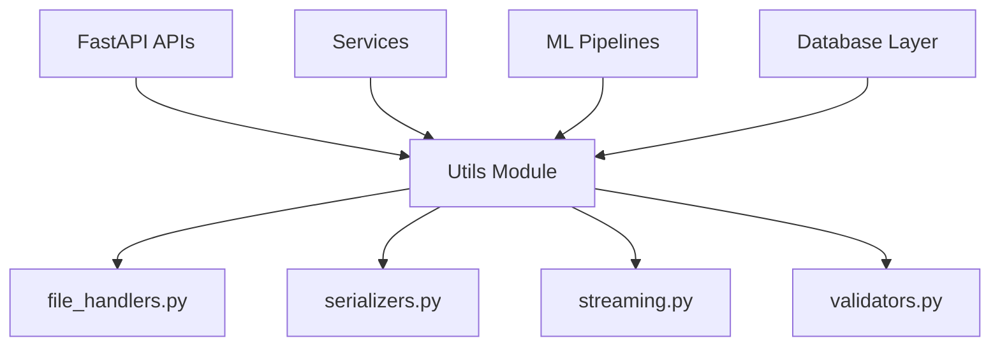
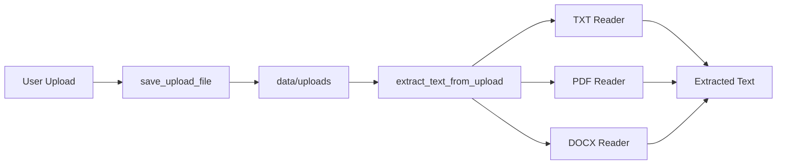

# Utils Module (`app/utils`)

The `utils/` module contains reusable helper utilities used throughout the Multimodal Hybrid RAG System.

These utilities handle:

- File upload & text extraction
- Streaming responses
- Input validation
- NumPy serialization cleanup
- General helper functionality

This module keeps shared low-level logic separated from:

- APIs
- Services
- ML pipelines
- Database layers

---

# 📁 Folder Structure

```plaintext
utils/
├── file_handlers.py
├── serializers.py
├── streaming.py
└── validators.py
```

---

# 🧠 Purpose of the Utils Module

The `utils/` layer exists to provide:

- Reusable helper functions
- Cleaner business logic
- Shared infrastructure helpers
- Better modularity
- Easier maintenance

Instead of duplicating utility logic across the project, everything centralized here can be reused anywhere in the system.

---

# 🔄 Utility Layer Architecture



---

# 📄 File Breakdown

---

# `file_handlers.py`

Handles:

- Safe file uploads
- File storage
- Text extraction from documents

---

# ✅ Supported File Types

| File Type | Supported |
|---|---|
| TXT | ✅ |
| PDF | ✅ |
| DOCX | ✅ |

---

# 🔄 Upload + Extraction Flow



---

# `save_upload_file()`

Safely stores uploaded files to disk.

---

## Features

- Auto-creates upload directories
- Binary-safe writing
- Async-compatible usage
- Clean path handling

---

## Example

```python
path = await save_upload_file(file, "document.pdf")
```

---

# `extract_text_from_upload()`

Extracts readable text from uploaded files.

---

## Internally Uses

| File Type | Library |
|---|---|
| PDF | `pypdf` |
| DOCX | `python-docx` |
| TXT | Native Python |

---

## Features

- Async execution using thread pools
- Safe error handling
- Logging integration
- Graceful fallback for unsupported formats

---

## Example

```python
text = await extract_text_from_upload(path, "pdf")
```

---

# `serializers.py`

Provides utilities for converting NumPy data types into JSON-safe Python types.

This is critical because FastAPI cannot directly serialize:

- `numpy.float32`
- `numpy.int64`
- `numpy.ndarray`
- Nested NumPy structures

---

# ⚠️ Problem Solved

Without serialization cleanup:

```plaintext
TypeError: 'numpy.float32' object is not iterable
```

---

# `to_python_float()`

Converts single NumPy numeric types.

---

## Example

```python
score = to_python_float(np.float32(0.92))
```

---

# `clean_numpy()`

Recursively converts nested NumPy objects inside:

- dictionaries
- lists
- nested structures

---

# 🔄 Serialization Flow


---

# Why This Is Important

This utility is heavily used in:

- RAG responses
- Retrieval metadata
- Explainability outputs
- Reranker scores
- Hybrid retrieval debugging

---

# `streaming.py`

Provides lightweight streaming utilities for RAG responses.

---

# `stream_rag_response()`

Streams generated answers chunk-by-chunk.

---

# 🔄 Streaming Flow


---

# Features

- Async generator-based streaming
- Adjustable chunk sizes
- Lightweight implementation
- FastAPI-compatible streaming

---

## Example

```python
async for chunk in stream_rag_response(answer):
    yield chunk
```

---

# Why Streaming Matters

Streaming improves:

- User experience
- Perceived latency
- Real-time response delivery
- Scalability for long outputs

---

# `validators.py`

Contains reusable validation helpers.

---

# `validate_query_length()`

Validates incoming query text.

---

# Validation Checks

| Check | Purpose |
|---|---|
| Empty query | Prevent invalid requests |
| Max length | Prevent abuse / oversized payloads |

---

# Example

```python
query = validate_query_length(user_query)
```

---

# 🔄 Validation Flow


---

# 🚀 Why the Utils Module Matters

Without utility abstraction:

- Logic becomes duplicated
- APIs become cluttered
- Serialization bugs increase
- File handling becomes inconsistent
- Validation becomes repetitive

The `utils/` layer ensures:

- Cleaner architecture
- Reusability
- Easier debugging
- Better scalability

---

# ✅ Summary

The `utils/` module provides reusable helper utilities powering the entire backend system.

It handles:

- File uploads & extraction
- NumPy serialization cleanup
- Streaming support
- Validation helpers

This keeps the rest of the architecture:

- Cleaner
- More modular
- Easier to maintain
- Production-ready