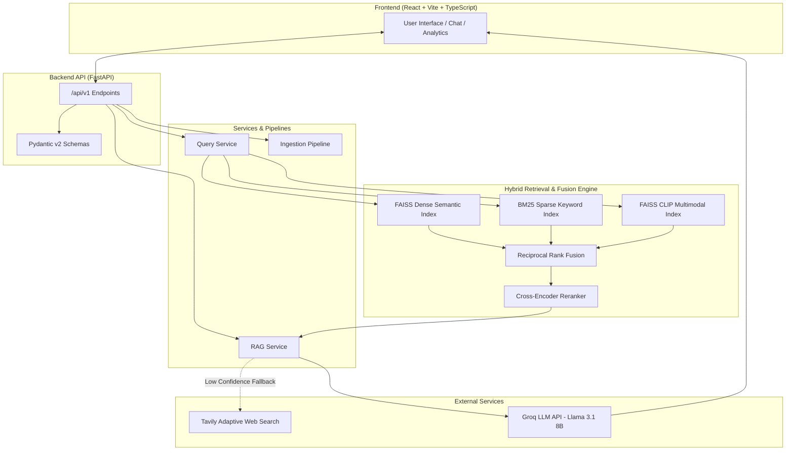

# 🏗️ System Architecture & Engineering Specifications

This document outlines the architecture, data flow, hybrid retrieval strategies, reranking, and explainability engine of the **Multimodal Hybrid RAG System**.

---

## 1. High-Level Architecture Diagram



---

## 2. Key System Components

### 2.1 Hybrid Retrieval Engine
Standard RAG systems rely solely on dense embeddings (which can miss exact keyword matches like product IDs or specialized codes) or sparse BM25 (which misses semantic synonyms). This system fuses three distinct retrieval channels:

1. **Dense Semantic Retrieval (FAISS)**:
   * Model: `sentence-transformers/all-MiniLM-L6-v2` (384-dimensional dense vectors).
   * Distance Metric: Cosine Similarity / Inner Product normalized L2.
2. **Sparse Keyword Retrieval (BM25)**:
   * Algorithm: `RankBM25Okapi` with stemming and token filtering.
   * Purpose: Exact keyword, acronym, and entity retrieval.
3. **Multimodal Vision Retrieval (CLIP)**:
   * Model: `openai/clip-vit-base-patch32` (512-dimensional joint text-image latent space).
   * Capability: Allows text queries to search image contents and image queries to find relevant text chunks.

---

### 2.2 Reciprocal Rank Fusion (RRF) & Dynamic Weighting
Candidate chunks retrieved from FAISS, BM25, and CLIP are unified using Reciprocal Rank Fusion (RRF):

$$\text{RRF\_Score}(d) = \sum_{m \in M} w_m \cdot \frac{1}{k + r_m(d)}$$

Where:
* $M = \{\text{FAISS}, \text{BM25}, \text{CLIP}\}$
* $r_m(d)$ is the rank of document $d$ in retriever $m$.
* $k = 60$ (RRF smoothing constant).
* $w_m$ is the **dynamic intent weight**:
  * *Informational Queries* ("what is", "explain"): Dense weight $w_{\text{FAISS}} = 1.2$, Sparse weight $w_{\text{BM25}} = 0.4$.
  * *Transactional / Code Queries* ("function", "error code"): Sparse weight $w_{\text{BM25}} = 1.0$, Dense weight $w_{\text{FAISS}} = 0.8$.
  * *Cross-Modal Queries* ("diagram", "image"): Vision weight $w_{\text{CLIP}} = 0.9$.

---

### 2.3 Cross-Encoder Reranking
Top candidate chunks ($k \times 4$) output by RRF are passed to a heavy-duty relevance scoring model:
* **Model**: `cross-encoder/ms-marco-MiniLM-L-6-v2`
* **Mechanism**: Jointly processes `(query, document_chunk)` tokens through multi-head self-attention layers to compute true pairwise relevance logits.
* **Score Blending**:
  $$\text{Final\_Score} = 0.75 \cdot \sigma(\text{Logit}_{\text{Reranker}}) + 0.25 \cdot \text{Normalized}_{\text{RRF}}$$

---

### 2.4 Per-Step Latency Profiling Engine
Every request executed by the system is instrumented with microsecond-accurate timers across all stages:

```json
{
  "latency_ms": {
    "query_expansion": 1.2,
    "text_embedding": 14.5,
    "faiss_dense_search": 3.8,
    "bm25_sparse_search": 2.1,
    "clip_vision_search": 18.4,
    "rrf_fusion": 0.9,
    "tavily_web_search": 0.0,
    "cross_encoder_rerank": 42.1,
    "llm_generation": 210.3,
    "total_backend_latency": 293.3
  }
}
```

This telemetry is returned directly in backend API payloads, allowing the frontend analytics view to render interactive execution waterfall charts.

---

### 2.5 Retrieval Explainability Engine
Every chunk returned to the user includes a detailed diagnostic breakdown:
* Raw FAISS cosine similarity score.
* Raw BM25 score.
* Raw CLIP vector similarity score.
* RRF rank position per retriever channel.
* Cross-Encoder confidence output.
* Source provenance (Document ID, Page Number, File Type, Web URL).
